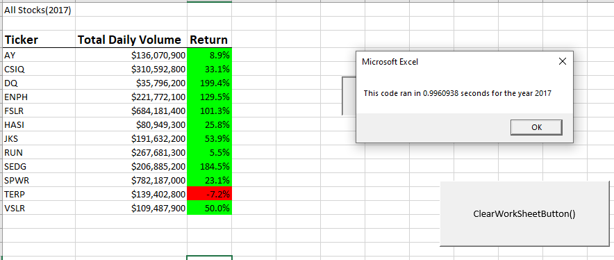

# Stock Analysis

## Overview of The Project:
### Purpose 
The purpose of this project is to help Steve ,who recently graduated in finance. Steve is going to help his first clients, which is his parents to invest in “DAQO New Energy Corp”, its ticker symbol is “DQ”.  His first step was to research couple of other stocks to diversify his client’s funds. To help Steve, we used Visual Basic for Applications (VBA), a programming language which interacts with Excel and do automated analysis for any stocks. With the help of VBA we wrote excel macros to analyze the data from raw data sheet provided.

[VBA_Challenge.xlsm](VBA_Challenge.xlsm)

In this challenge we first wrote the code to analyze the data, then using the same information, we re-factored the code to improve the performance of VBA script. This analysis helped in preparing a written report about our findings to help Steve in decision making. 
## Results
### Analysis
The Data sheet contains details of 12 different stocks for two consecutive years 2017 and 2018. This included the ticker values, date the stock was issued, its opening price, closing price along with adjusted closing price, the high and low prices, and the volume of stock. First to analyze the DQ stock data, a DQ Analysis Worksheet was created to get the output of total daily Volume and yearly return from 2017 and 2018 worksheet. This was achieved using some of the technical features available in VBA , for ex – Looping process, array handling techniques , conditional statements etc.
Insert Code 
Insert Output
After analyzing the data i.e., “DQ analysis” we saw and return of 199% for “DQ” in 2017, but there is a 63 % drop in 2018 for stock “DQ”, As a good financial analyst Steve wants to offer better service to his clients. Steve had to analyze other stocks, so we created “AllStocksAnalysis” worksheet with three columns “Ticker”, “TotalDailyVolume” and “Return” using data from 2017 and 2018 sheet. During this analysis, we found out that, a big drop in all stocks including DQ happened in 2018 compared to 2017 with the exception of few stocks like “RUN” and ENPH which gave a continuous growth in 2017 and 2018. Hope this data helps Steve to choose the best choice. Along with this challenge to prepare an output for analysis using vb script / macro. We refactored the macro code by removing one “for loop”. This gave a better performance by increasing the efficiency of program execution.
## Summary
1)	What are the advantages or disadvantages of refactoring code?
      - Refactoring code reduced macro run time. Compared to the code with multiple loops which used to take more than 1 sec, refactored code 
        took less than a second.

   ### Before Refactoring the code
 

 
###  After refactoring the code

 

 
